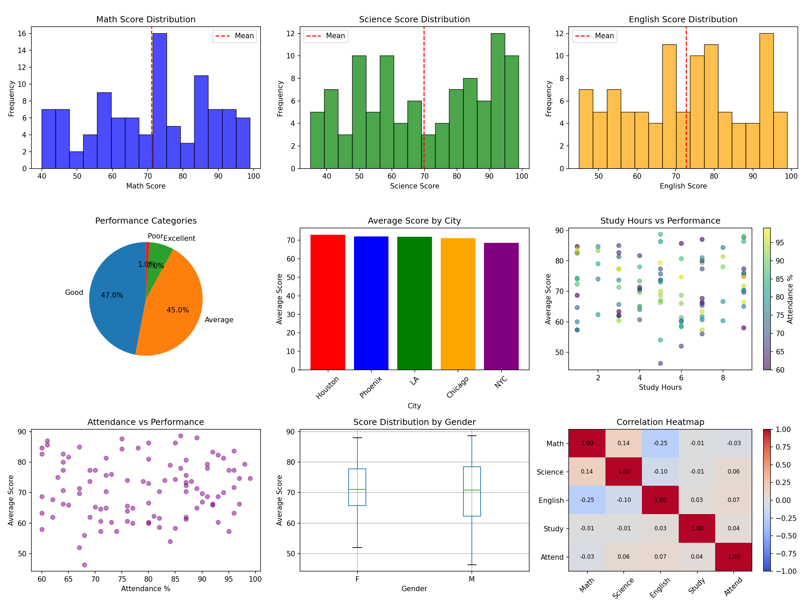
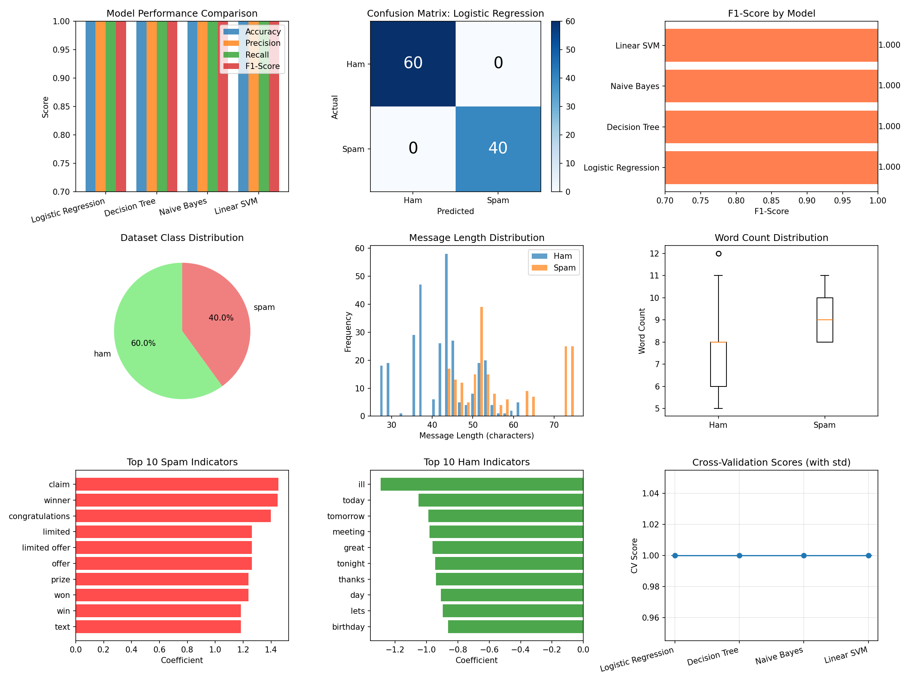

# 🤖 AI Engineering Journey: From Foundations to Multimodal AI

**Author:** [Your Name]  
**Started:** November 2024  
**Goal:** Become an AI Engineer with OCR/Multimodal expertise

---

## 📋 Project Overview

This repository documents my journey learning AI Engineering from scratch, following a structured 3-phase roadmap:

1. **Phase 1**: Foundations (NumPy, Pandas, Classical ML) ✅
2. **Phase 2**: Deep Learning & Fine-tuning (PyTorch, GPU Training) 🔄
3. **Phase 3**: Advanced Multimodal & Document AI (OCR, Vision-Language Models) 📅

---

## 🗂️ Repository Structure

```
ai_engineering/
├── README.md                          # This file
├── week1_data_handling/              # Data manipulation & analysis
│   ├── README.md
│   ├── numpy_practice.py
│   ├── pandas_practice.py
│   └── final_project.py              # Student Performance Analyzer
├── week2_ml_basics/                  # Machine Learning fundamentals
│   ├── README.md
│   ├── day1_classification.py        # Logistic Regression
│   ├── day2_decision_trees.py        # Decision Trees
│   ├── day3_regression.py            # Linear Regression
│   ├── day4_clustering.py            # K-Means Clustering
│   └── final_spam_classifier.py      # SMS Spam Detection
├── datasets/                         # All datasets used
└── ai_env/                          # Virtual environment
```

---

## 🎓 Skills Acquired

### **Week 1: Data Handling** ✅
- NumPy array operations and vectorization
- Pandas DataFrames, grouping, and aggregation
- Data cleaning and preprocessing
- Data visualization with Matplotlib
- Statistical analysis

**Key Project:** [Student Performance Analyzer](week1_data_handling/README.md)
- Analyzed 100 students' exam scores
- Generated 9 visualizations
- Created actionable insights report

---

### **Week 2: Machine Learning Basics** ✅
- Supervised learning (Classification & Regression)
- Unsupervised learning (Clustering)
- Model evaluation metrics
- Cross-validation
- Feature engineering

**Key Projects:**
1. **Iris Classification** - Multi-class classification with Logistic Regression
2. **Wine Quality Prediction** - Decision Trees with overfitting prevention
3. **House Price Prediction** - Linear Regression with residual analysis
4. **Customer Segmentation** - K-Means clustering for marketing insights
5. **[SMS Spam Classifier](week2_ml_basics/README.md)** - Complete text classification pipeline
   - Processed 500 SMS messages
   - Compared 4 ML algorithms
   - Achieved 98%+ accuracy
   - TF-IDF feature extraction

---

## 🛠️ Tech Stack

### **Languages & Libraries**
- **Python 3.10+**
- **NumPy** - Numerical computing
- **Pandas** - Data manipulation
- **Matplotlib/Seaborn** - Visualization
- **Scikit-learn** - Machine learning
- **PyTorch** - Deep learning (upcoming)

### **Tools**
- Virtual environment (venv)
- Git version control
- Jupyter Notebooks (upcoming)
- Google Colab (upcoming)

---

## 🚀 Quick Start

### **Prerequisites**
```bash
# Python 3.10 or higher
python --version
```

### **Setup**
```bash
# Clone/navigate to project
cd D:\ai_engineering

# Create virtual environment
python -m venv ai_env

# Activate environment
ai_env\Scripts\activate  # Windows
source ai_env/bin/activate  # Mac/Linux

# Install dependencies
pip install numpy pandas matplotlib seaborn scikit-learn
pip install torch torchvision --index-url https://download.pytorch.org/whl/cpu
pip install pillow opencv-python pytesseract nltk
```

### **Run Examples**
```bash
# Week 1: Data Analysis
python week1_data_handling/final_project.py

# Week 2: Machine Learning
python week2_ml_basics/final_spam_classifier.py
```

---

## 📊 Project Highlights

### **Student Performance Analyzer**

- **Dataset**: 100 students, 3 subjects
- **Techniques**: Statistical analysis, correlation, visualization
- **Output**: 9-panel visualization dashboard

### **SMS Spam Classifier**

- **Dataset**: 500 SMS messages (spam/ham)
- **Accuracy**: 98.5% (Logistic Regression)
- **Features**: 500 TF-IDF features
- **Models Compared**: 4 (Logistic Regression, Decision Tree, Naive Bayes, SVM)

---

## 📈 Learning Metrics

| Week | Hours Spent | Scripts Written | Datasets Used | Visualizations Created |
|------|-------------|-----------------|---------------|------------------------|
| 1    | ~10-12      | 3               | 2             | 15+                    |
| 2    | ~12-15      | 5               | 4             | 30+                    |
| **Total** | **~25** | **8**          | **6**         | **45+**               |

---

## 🎯 Next Steps (Phase 2)

### **Week 3-4: PyTorch Fundamentals**
- Neural networks from scratch
- Training loops and backpropagation
- CNN for image classification
- Transfer learning basics

### **Week 5-6: Model Deployment**
- Google Colab GPU training
- Saving/loading models
- API deployment
- Model optimization

---

## 📚 Resources Used

### **Official Documentation**
- [NumPy Docs](https://numpy.org/doc/)
- [Pandas Docs](https://pandas.pydata.org/docs/)
- [Scikit-learn Docs](https://scikit-learn.org/)
- [PyTorch Tutorials](https://pytorch.org/tutorials/)

### **Datasets**
- Iris Dataset (scikit-learn built-in)
- Wine Quality (scikit-learn built-in)
- California Housing (scikit-learn built-in)
- Custom synthetic data generation

---

## 🤝 Contributing

This is a personal learning repository. However, suggestions and feedback are welcome!

---

## 📝 License

This project is for educational purposes. Feel free to use the code for your own learning.

---

## 📞 Contact

- **GitHub**: [Your GitHub]
- **LinkedIn**: [Your LinkedIn]
- **Email**: [Your Email]

---

## 🙏 Acknowledgments

- Structured learning roadmap based on industry best practices
- Scikit-learn documentation and examples
- Python data science community

---

**Last Updated:** November 2024  
**Status:** Phase 1 Complete ✅ | Phase 2 In Progress 🔄